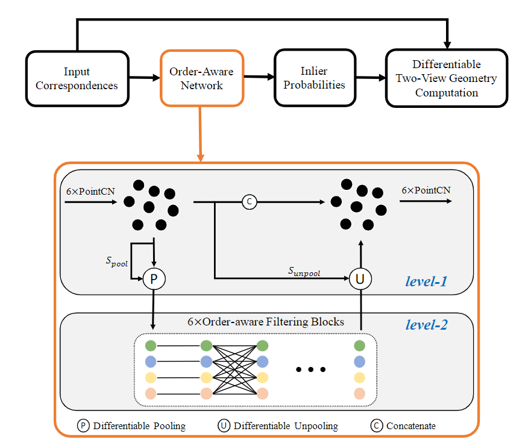

# OANet(Geometry Matching)
This repo contains code for ICCV 2019 paper [Learning Two-View Correspondences and Geometry Using Order-Aware Network](https://arxiv.org/abs/1908.04964).

## Data Prepare

1. Download YFCC100M dataset. 
```
bash download_data.sh raw_data raw_data_yfcc.tar.gz 0 8
tar -xvf raw_data_yfcc.tar.gz
```

2. Download SUN3D testing (1.1G) and training (31G) dataset. 
```
bash download_data.sh raw_sun3d_test raw_sun3d_test.tar.gz 0 2
tar -xvf raw_sun3d_test.tar.gz
bash download_data.sh raw_sun3d_train raw_sun3d_train.tar.gz 0 63
tar -xvf raw_sun3d_train.tar.gz
```

3. Generate matches by **SIFT** for YFCC100M
```
bash generate_yfcc_data.sh
```

4. Generate matches by **SIFT** for SUN3D
```
bash generate_sun3d_data.sh
```

## Pretrained Model
Download pretrained model. 

```
git clone https://github.com/zjhthu/OANet.git 
cd OANet 
wget https://research.altizure.com/data/oanet_data/model_v2.tar.gz 
tar -xvf model_v2.tar.gz
cd model
wget https://research.altizure.com/data/oanet_data/sift-gl3d.tar.gz
tar -xvf sift-gl3d.tar.gz
```

## Model

<div align=center></div>

## Train & Test

1. If you have multiple gpus, it is recommended to use `train_multi_gpu.py` training. `train_single_gpu.py` is recommended for debugging.

```
# train by multi gpu
CUDA_VISIBLE_DEVICES=1,5 python -m torch.distributed.launch --nproc_per_node=2 --use_env train_muti_gpu.py

# train by single gpu
python train_single_gpu.py
```

2. Test

```
python test.py
```

## Config

Don't forget to modify config.py, you should modify it according to your environment.

## Contribution

1. The repository has **re-integrated** the code.

2. Add **tensorboard** tool to display loss convergence in real time. 

3. Provides **single-gpu** and **multi-gpu** training scripts, using DDP distribution **greatly** increases the utilization of gpu.

4. Use **epoch** instead of iteration when training.

5. Add many comments to facilitate the understanding of the code.

## Acknowledgement

We borrow code from public projects. We mainly borrow code from [OANet](https://github.com/zjhthu/OANet).

## Reference

[1] Zhang, Jiahui, et al. "Learning Two-View Correspondences and Geometry Using Order-Aware Network." The IEEE International Conference on Computer Vision. ICCV, 2019.
