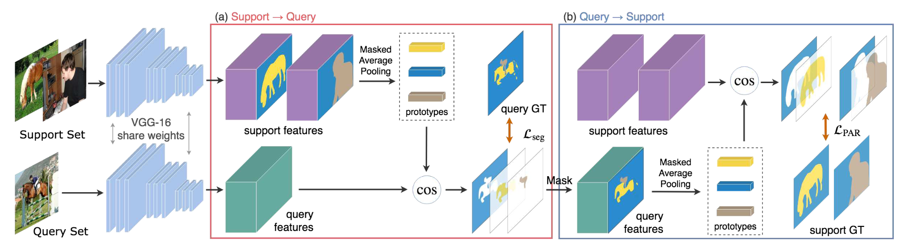

# PANet(Few-shot Segmentation)
This repo contains code for ICCV 2019 paper [PANet: Few-Shot Image Semantic Segmentation with Prototype Alignment](https://arxiv.org/abs/1908.06391).

## Data Prepare

1. Download Pascal VOC from [here](https://pan.baidu.com/s/15JA12xKtWgh-CAmhyVq6cg)(key: ltf0) and put them under `data/Pascal/VOCdevkit`. Image which we use from `JPEGImages` and we not use any other folders. 

2. Download SegmentationClassAug, SegmentationObjectAug, ScribbleAugAuto from [here](https://pan.baidu.com/s/1fnkniSEDazDOaOtof7H2hA)(key: ltf0) and put them under `VOCdevkit/VOC2012`.

3. Download Segmentation from [here](https://pan.baidu.com/s/1JfoBpmjl7hR8eeu6k6Solw)(key: ltf0) and use it to replace `VOCdevkit/VOC2012/ImageSets/Segmentation`.

## Model

Backbone: Download VGG pretrained from [here](https://pan.baidu.com/s/1xAx9wD9hFJQ5V4RTG7abpg)(key: ltf0) and put them under `./pretrained_model`.

<div align=center></div>

## Train & Test

```
bash train.sh
```

```
bash test.sh
```

## Config

1. Don't forget to modify config.py, you should modify it according to your environment and mode(train/test) what you need.

2. if the mode is **test**, you need to modify the variable `mode` to `test` and the variable `n_steps` to `1000`.

## Contribution

1. The repository has re-integrated the code. 

2. Remove the `sacred` tool, the code is more brief. 

3. Add `tensorboard` tool to display loss convergence in real time. 

4. Add `log` generation tool, use `train.sh/test.sh` to generate log files

## Acknowledgement

We borrow code from public projects. We mainly borrow code from [PANet](https://github.com/kaixin96/PANet).

## Reference

[1] Wang, Kaixin, et al. "PANet: Few-Shot Image Semantic Segmentation With Prototype Alignment." The IEEE International Conference on Computer Vision. ICCV, 2019.
